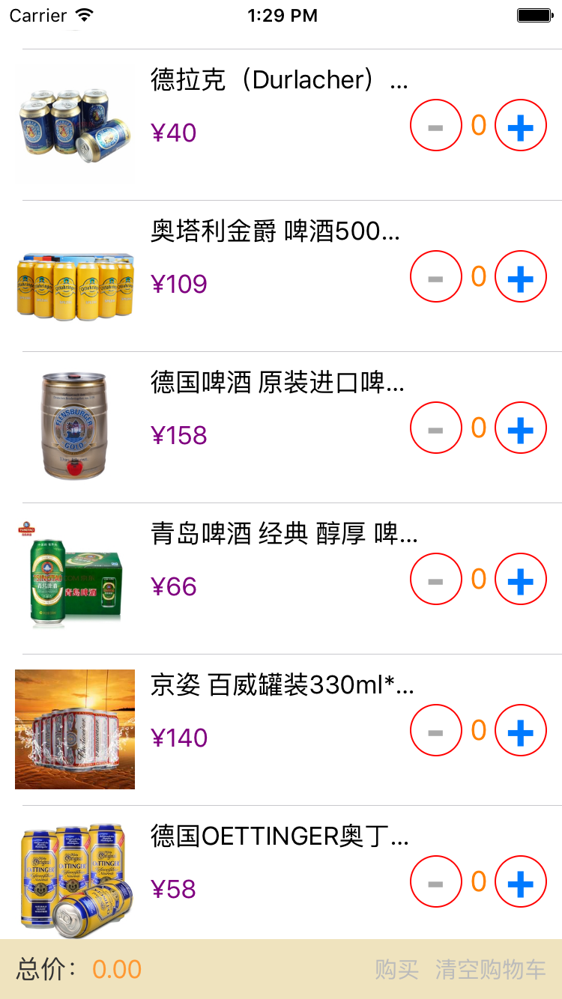

# day 08
## 简单购物车

#### 关注点
- storyboard自定义等高cell
- 简单MVC
- 代理设计模式
- 圆角按钮

#### 基本步骤
- storyboard界面

- 添加数据源
```objc
#pragma mark - 懒加载，模型解析
 - (NSArray *)wines {
     if (_wines == nil) {
         _wines = [SLWine mj_objectArrayWithFilename:@"wine.plist"];
     }
     return _wines;
 }
 #pragma mark - UITableView数据源方法
  - (NSInteger)tableView:(UITableView *)tableView numberOfRowsInSection:(NSInteger)section
 {
     return self.wines.count;
 }
 - (UITableViewCell *)tableView:(UITableView *)tableView cellForRowAtIndexPath:(NSIndexPath *)indexPath
 {
     SLWineTableViewCell *cell = [tableView dequeueReusableCellWithIdentifier:@"wine"];
     if (!cell) {
         cell = [[SLWineTableViewCell alloc] init];
     }
     cell.wine = self.wines[indexPath.row];
     cell.delegate = self;
     return cell;
 }
```
- 自定义cell
 - 新建`SLWineTableViewCell`类，设置storyboard的cell为但钱类，拖线拿到相应控件属性和事件
   ```objc
     @interface SLWineTableViewCell ()
     /** 图片标签 */
     @property (nonatomic, weak) IBOutlet UIImageView    *iconView;
     /** 名字标签 */
     @property (nonatomic, weak) IBOutlet UILabel *nameLabel;
     /** 价钱标签 */
     @property (nonatomic, weak) IBOutlet UILabel    *priceLabel;
     /** 加一个按钮 */
     @property (nonatomic, weak) IBOutlet SLCircleButton    *ad   dButton;
     /** 减一个按钮 */
     @property (nonatomic, weak) IBOutlet SLCircleButton    *removeButton;
     /** 数量标签 */
     @property (nonatomic, weak) IBOutlet UILabel *numLabel;
     @end
     @implementation SLWineTableViewCell
     - (IBAction)addButton:(UIButton *)button {
          self.wine.count += 1;
          self.removeButton.enabled = YES;
          self.numLabel.text = [NSString stringWithFormat:@"%d", self.wine.count];
          if ([self.delegate respondsToSelector:@selector(wineTableViewCell: addbuttonClick:)]) {
              [self.delegate wineTableViewCell:self addbuttonClick:button];
         }
     }
     - (IBAction)removeButton:(UIButton *)button {
          self.wine.count -= 1;
          self.numLabel.text = [NSString stringWithFormat:@"%d", self.wine.count];
          if (self.wine.count == 0) {
              button.enabled = NO;
          }
          if ([self.delegate respondsToSelector:@selector(wineTableViewCell: removebuttonClick:)]) {
              [self.delegate wineTableViewCell:self removebuttonClick:button];
          }
     }
     - (void)setWine:(SLWine *)wine {
          _wine = wine;
          self.iconView.image = [UIImage imageNamed:wine.image];
          self.nameLabel.text = wine.name;
          self.priceLabel.text = [NSString stringWithFormat:@"¥%@", wine.money];    
          self.numLabel.text = [NSString stringWithFormat:@"%d", self.wine.count];
          if (self.wine.count == 0) {
              self.removeButton.enabled = NO;
          }
     }
     @end
   ```
 - cell的代理
   ```objc
   #import <UIKit/UIKit.h>
   @class SLWine, SLWineTableViewCell;
   @protocol SLWineTableViewCelldelegate <NSObject>
   @optional
   - (void)wineTableViewCell:(SLWineTableViewCell *)cell addbuttonClick:(UIButton *)button;
   - (void)wineTableViewCell:(SLWineTableViewCell *)cell removebuttonClick:(UIButton *)button;
   @end
   
   @interface SLWineTableViewCell : UITableViewCell
   /** 酒模型 */
   @property (nonatomic, strong) SLWine *wine;
   /** Cell的代理 */
   @property (nonatomic, weak) id<SLWineTableViewCelldelegate> delegate;
   @end
   ```
- 圆角按钮
 - 自定义按钮`SLCircleButton`
 - 头文件`SLCircleButton.h`
   ```objc
    #import <UIKit/UIKit.h>
    @interface SLCircleButton : UIButton
    @end
   ```
 - 实现`SLCircleButton.m`
   ```objc
   #import "SLCircleButton.h"
   @implementation SLCircleButton
   - (void)awakeFromNib
   {
      // 设置边框宽度
     self.layer.borderWidth = 1.0;
     // 设置边框颜色
     self.layer.borderColor = [UIColor redColor].CGColor;
     // 设置圆角半径
     self.layer.cornerRadius = self.frame.size.width * 0.5;
   }
   @end
    ```
    
#### iOS通知机制
- 要点
 - 通知的发布
 - 通知的监听
 - 通知的移除
- 通知中心
 - 每一个应用程序都有一个通知中心`NSNotificationCenter`实例，专门负责协助不同对象之间的消息通信
 - 任何一个对象都可以向通知中心发布通知`NSNotification`，描述自己在做什么
 - 其他感兴趣的对象`Observer`可以申请在某个特定通知发布时(或在某个特定的对象发布通知时)收到这个通知
- 通知简介
 - 三个属性
   ```objc
   - (NSString *)name; // 通知的名称
   - (id)object; // 通知发布者(是谁要发布通知)
   - (NSDictionary *)userInfo; // 一些额外的信息(通知发布者传递给通知接收者的信息内容)
   ```
 - 初始化
   ```objc
   + (instancetype)notificationWithName:(NSString *)aName object:(id)anObject;
   + (instancetype)notificationWithName:(NSString *)aName object:(id)anObject userInfo:(NSDictionary *)aUserInfo;
   - (instancetype)initWithName:(NSString *)name object:(id)object userInfo:(NSDictionary *)userInfo;
   ```
- 通知发布
 - 通知中心`NSNotificationCenter`提供了相应的方法来帮助发布通知
   ```objc
   // 发布一个notification通知，可在notification对象中设置通知的名称、通知发布者、额外信息等
   - (void)postNotification:(NSNotification *)notification;
   // 发布一个名称为aName的通知，anObject为这个通知的发布者
   - (void)postNotificationName:(NSString *)aName object:(id)anObject;
   // 发布一个名称为aName的通知，anObject为这个通知的发布者，aUserInfo为额外信息
   - (void)postNotificationName:(NSString *)aName object:(id)anObject userInfo:(NSDictionary *)aUserInfo;
  ```
- 通知监听
 - 注册监听器，通知中心`NSNotificationCenter`提供了方法来注册一个监听通知的监听器`Observer`
   ```objc
    /**
     *  observer：监听器，即谁要接收这个通知
     *  aSelector：收到通知后，回调监听器的这个方法，并且把通知对象当做参数传入
     *  aName：通知的名称。如果为nil，那么无论通知的名称是什么，监听器都能收到这个通知
     *  anObject：通知发布者。如果为anObject和aName都为nil，监听器都收到所有的通知
     */
     - (void)addObserver:(id)observer selector:(SEL)aSelector name:(NSString *)aName object:(id)anObject;
     /**
      *  name：通知的名称
      *  obj：通知发布者
      *  block：收到对应的通知时，会回调这个block
      *  queue：决定了block在哪个操作队列中执行，如果传nil，默认在当前操作队列中同步执行
      */
     - (id)addObserverForName:(NSString *)name object:(id)obj queue:(NSOperationQueue *)queue usingBlock:(void (^)(NSNotification *note))block;
   ```
 - 移除监听
   ```objc
   - (void)removeObserver:(id)observer;
   - (void)removeObserver:(id)observer name:(NSString *)aName object:(id)anObject;
   ```
- UIDecive的通知
 - UIDevice类提供了一个单粒对象，它代表着设备，通过它可以获得一些设备相关的信息
   - 电池电量值(batteryLevel)
   - 电池状态(batteryState)
   - 设备的类型(model，比如iPod、iPhone等)
   - 设备的系统(systemVersion)
 - 通过`[UIDevice currentDevice]`可以获取这个单粒对象
 - UIDevice对象会不间断地发布一些通知
         UIDeviceOrientationDidChangeNotification    // 设备旋转
         UIDeviceBatteryStateDidChangeNotification   // 电池状态改变
         UIDeviceBatteryLevelDidChangeNotification   // 电池电量改变
         UIDeviceProximityStateDidChangeNotification // 近距离传感器(比如设备贴近了使用者的脸部)
- 键盘的通知
 - 我们经常需要在键盘弹出或者隐藏的时候做一些特定的操作,因此需要监听键盘的状态
 - 键盘状态改变的时候,系统会发出一些特定的通知
         UIKeyboardWillShowNotification         // 键盘即将显示
         UIKeyboardDidShowNotification          // 键盘显示完毕
         UIKeyboardWillHideNotification         // 键盘即将隐藏
         UIKeyboardDidHideNotification          // 键盘隐藏完毕
         UIKeyboardWillChangeFrameNotification  // 键盘的位置尺寸即将发生改变
         UIKeyboardDidChangeFrameNotification   // 键盘的位置尺寸改变完毕
 - 系统发出键盘通知时,会附带一下跟键盘有关的额外信息(字典),字典常见的key如下:
         UIKeyboardFrameBeginUserInfoKey         // 键盘刚开始的frame
         UIKeyboardFrameEndUserInfoKey           // 键盘最终的frame(动画执行完毕后)
         UIKeyboardAnimationDurationUserInfoKey  // 键盘动画的时间
         UIKeyboardAnimationCurveUserInfoKey     // 键盘动画的执行节奏(快慢)
- 通知和代理
 - 共同点<br/>
利用通知和代理都能完成对象之间的通信<br/>
(比如A对象告诉D对象发生了什么事情, A对象传递数据给D对象)
 - 区别
    - 代理 : 1个对象只能告诉另1个对象发生了什么事情
    - 通知 : 1个对象能告诉N个对象发生了什么事情, 1个对象能得知N个对象发生了什么事情


 


